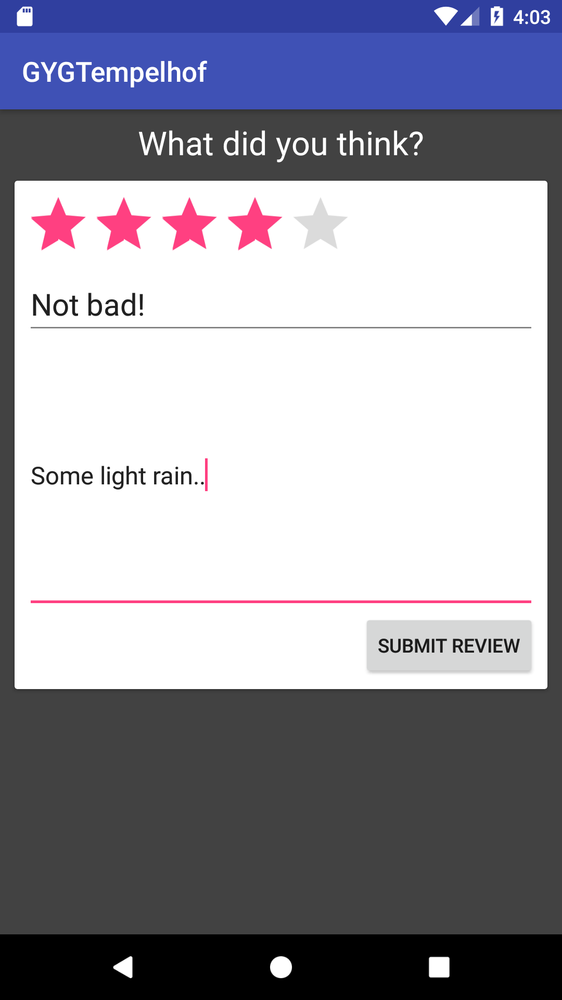
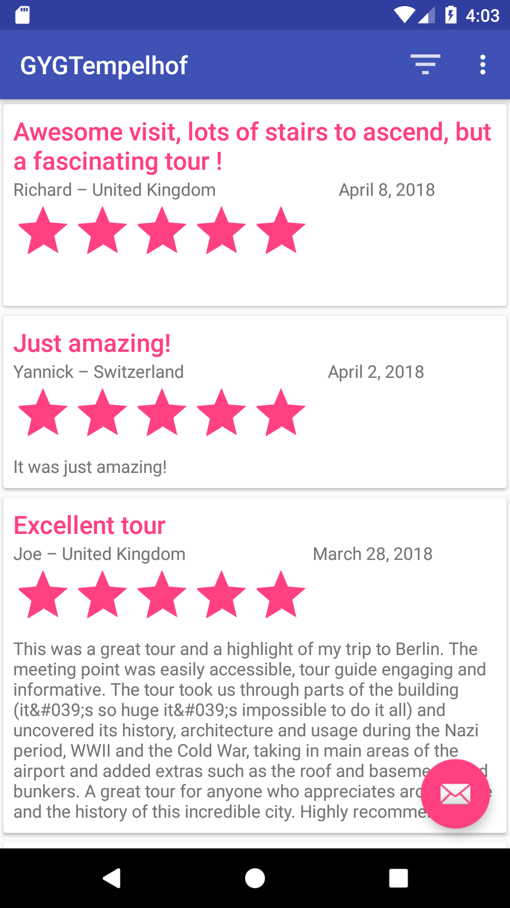
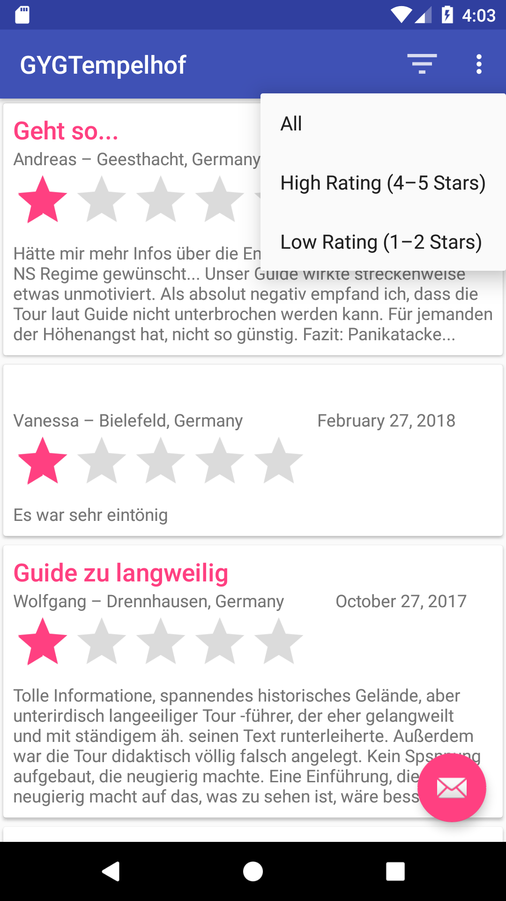

# GetYourGuide - Tempelhof

Android application to fulfill the GetYourGuide project requirements: the ability to browse and post reviews for [Berlin Tempelhof Airport: The Legend of Tempelhof](https://www.getyourguide.com/berlin-l17/tempelhof-2-hour-airport-history-tour-berlin-airlift-more-t23776/).

## Design
For this project I made extensive use of Model-View-Controller architecture and a singleton data repository pattern. There are two activities:
- Reviews, the main activity, allows the users to browse the reviews posted for this tour. It can be refreshed to pull new reviews, if any, from the webserver, and can also be filtered.
- AddReview, a child activity, allows the user to post a new review for this tour.

Both activities are made in MVC architecture. There is a base activity class that creates the presenter and view. The main fragment for each activity also serves to fulfill the view-contract. The presenter controls the view's business logic, including interacting with the backing data repository.

The data repository allows there to be a single source of truth for data in the application. It combines an in-memory cache, a persistent local database, and web-service calls behind a single interface.

## Testing Instructions
Launch the application using one of the following methods:
- [Test it out in the web browser!](https://appetize.io/app/crtzuyd1t7ef3zf5xyn759gnnm)
- Open the project in Android Studio
	- debug using an emulator or usb device
	- or build apk and load it onto a device
- I haven't included a .apk in this git repo but I can send you one if you want

Launch the app.
- pull down to refresh the list of reviews from the web server

Apply a filter
- click the filter icon 
- select an option (All, high-rating, or low-rating)

Add a new review:
- click the FAB to launch the new review activity
- to be able to submit a review, you must fill in a rating, title, and message
- after succesfully submitting a review, you should be able to see it in the list of reviews activity
- to make it a little easier to see, you can apply the low-rating filter to cut down the number of reviews, and then make a new review with 1-2 stars. Or just scroll through 400+ reviews
- the new reviews you create should persist in the local db, even through destroying and re-opening the activity. However, as soon as you refresh the list of reviews, it will pull data from the server. Because the reviews you created have not really been posted, they will all dissapear.

Testing offline (airplane mode):
- new user - won't see any reviews, but can create new reviews
- user who has loaded reviews previously should continue to see the previously loaded reviews. They persist in the local db even through activity destruction + recreation

## Notes
- Per the project instructions, the app UI "does not need to handle orientation changes." Therefore all activities are set to portrait mode and will not rotate.
- Per the instructions, the app should "allow users to browse all of the reviews...". I didn't implement an incremental loading or paging feature, so it can stutter a bit on the 400+ reviews. If I had more time this would be a great way to improve the usability of the app
- Per the instructions, the posting a new review feature does not really hit the web server. My mock version of the post-response returns a review_id object - the id of the newly created review.
- Unfortunately due to the 48hr time limit, there is no unit testing suite to speak of. However, I think the architecture of the application lends itself well to unit testing. The Data Repository pattern + Injection method in particular makes it easy for unit tests to mock the data sources, to mock web server calls, etc.

## Libraries Used
- Retrofit, OkHttp, Gson - A solid combination of networking libraries for the remote data source implementation. I hit the specified web service and convert the JSON payload into Java objects
- Room - persistence library built on SQLite for the local data source. This will ensure there is data available when the app is started in offline mode (provided it was previously opened with internet)
- Honorable mentions: RxAndroid & Kotlin co-routines. I just barely used each of these in the remote data source and local data source, respectively. Most of the async logic is just using callbacks for now.

## Screenshots:

